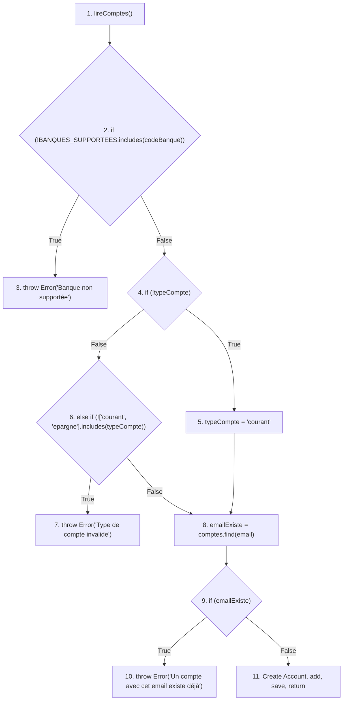
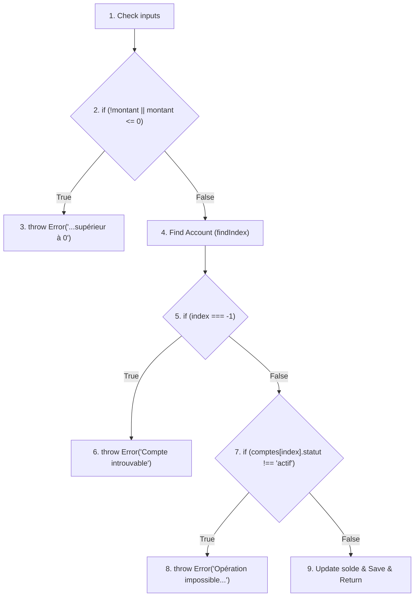
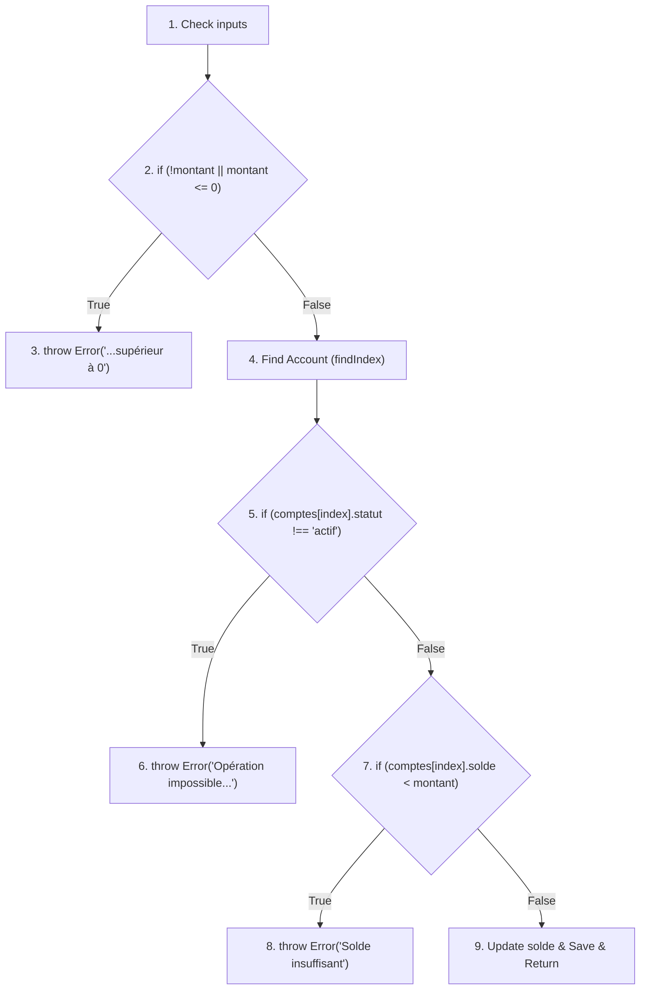
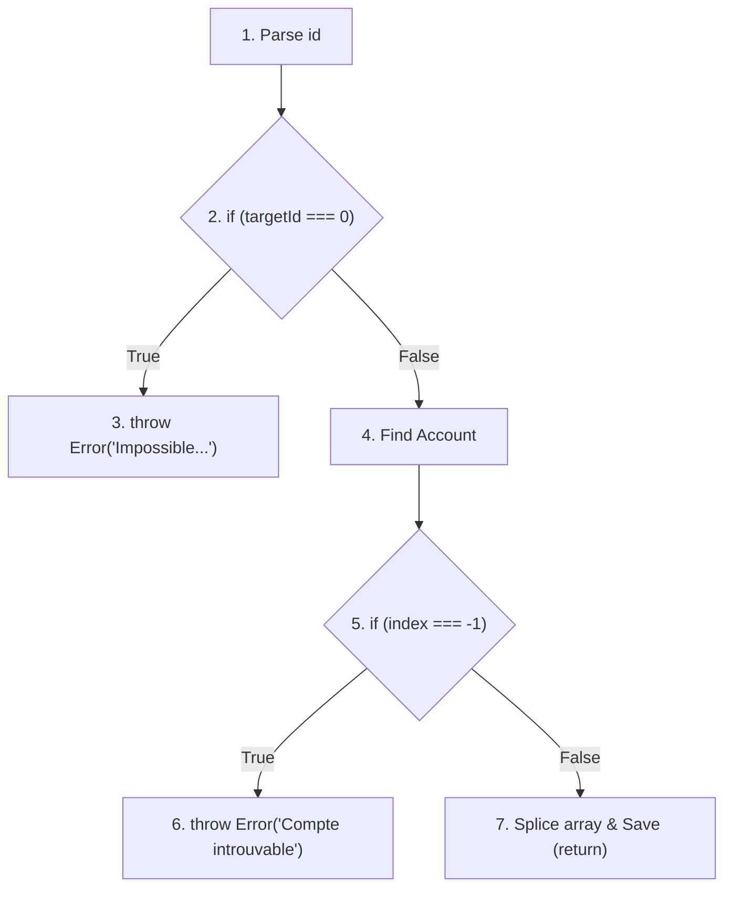

# Rapport d'Analyse des Graphes de Contrôle et Couverture

Ce document présente l'analyse des Control Flow Graphs (CFG), l'identification des chemins ainsi que les **tables de couverture détaillées (Coverage Tables)** pour 5 fonctionnalités majeures de l'API (issues de [logic.js](file:///home/atiwa/Bureau/ICT_304/banque-api/logic.js)).

---

## 1. Fonction [creerCompte](file:///home/atiwa/Bureau/ICT_304/banque-api/logic.js#69-106)

### Graphe de Contrôle de Flux (CFG)

### Identification des Chemins
* **P1** : 1 → 2 → 3 
* **P2** : 1 → 2 → 4 → 5 → 8 → 9 → 10 
* **P3** : 1 → 2 → 4 → 5 → 8 → 9 → 11 
* **P4** : 1 → 2 → 4 → 6 → 7 
* **P5** : 1 → 2 → 4 → 6 → 8 → 9 → 10 
* **P6** : 1 → 2 → 4 → 6 → 8 → 9 → 11 

### Coverage Tables

**Statement Coverage Table (100%)**
La combinaison des chemins **P1, P2 (ou P5), P3 (ou P6) et P4** suffit pour couvrir tous les nœuds (Statements).

| Nœuds (Statements) | P1 | P2 | P3 | P4 | P5 | P6 |
| :---: | :---: | :---: | :---: | :---: | :---: | :---: |
| 1 | X | X | X | X | X | X |
| 2 | X | X | X | X | X | X |
| 3 | X | | | | | |
| 4 | | X | X | X | X | X |
| 5 | | X | X | | | |
| 6 | | | | X | X | X |
| 7 | | | | X | | |
| 8 | | X | X | | X | X |
| 9 | | X | X | | X | X |
| 10 | | X | | | X | |
| 11 | | | X | | | X |

**Branch Coverage Table (100%)**
La combinaison des chemins **P1, P3, P4 et P5** suffit pour tester chaque branche (Vrai/Faux) de chaque condition IF.

| Branches (Décisions) | P1 | P2 | P3 | P4 | P5 | P6 |
| :--- | :---: | :---: | :---: | :---: | :---: | :---: |
| (2) !Banque (True / False) | T | F | F | F | F | F |
| (4) !typeCompte (True / False) | | T | T | F | F | F |
| (6) Type invalide (True / False) | | | | T | F | F |
| (9) emailExiste (True / False) | | T | F | | T | F |

---

## 2. Fonction [deposer](file:///home/atiwa/Bureau/ICT_304/banque-api/logic.js#116-145)

### Graphe de Contrôle de Flux (CFG)

### Identification des Chemins
* **P1** : 1 → 2 → 3
* **P2** : 1 → 2 → 4 → 5 → 6
* **P3** : 1 → 2 → 4 → 5 → 7 → 8
* **P4** : 1 → 2 → 4 → 5 → 7 → 9

### Coverage Tables

**Statement Coverage Table (100%)**
Les 4 chemins sont nécessaires.

| Nœuds | P1 | P2 | P3 | P4 |
| :---: | :---: | :---: | :---: | :---: |
| 1 | X | X | X | X |
| 2 | X | X | X | X |
| 3 | X | | | |
| 4 | | X | X | X |
| 5 | | X | X | X |
| 6 | | X | | |
| 7 | | | X | X |
| 8 | | | X | |
| 9 | | | | X |

**Branch Coverage Table (100%)**

| Branches (Décisions) | P1 | P2 | P3 | P4 |
| :--- | :---: | :---: | :---: | :---: |
| (2) Montant invalide | T | F | F | F |
| (5) Index === -1 | | T | F | F |
| (7) Statut inactif | | | T | F |

---

## 3. Fonction [retirer](file:///home/atiwa/Bureau/ICT_304/banque-api/logic.js#146-175)

### Graphe de Contrôle de Flux (CFG)

### Identification des Chemins
* **P1** : 1 → 2 → 3 
* **P2** : 1 → 2 → 4 → 5 → 6 
* **P3** : 1 → 2 → 4 → 5 → 7 → 8 
* **P4** : 1 → 2 → 4 → 5 → 7 → 9 

### Coverage Tables

**Statement Coverage Table (100%)**

| Nœuds | P1 | P2 | P3 | P4 |
| :---: | :---: | :---: | :---: | :---: |
| 1-2 | X | X | X | X |
| 3 | X | | | |
| 4-5 | | X | X | X |
| 6 | | X | | |
| 7 | | | X | X |
| 8 | | | X | |
| 9 | | | | X |

**Branch Coverage Table (100%)**

| Branches (Décisions) | P1 | P2 | P3 | P4 |
| :--- | :---: | :---: | :---: | :---: |
| (2) Montant invalide | T | F | F | F |
| (5) Statut inactif | | T | F | F |
| (7) Solde < montant | | | T | F |

---

## 4. Fonction [transferer](file:///home/atiwa/Bureau/ICT_304/banque-api/logic.js#176-252)

*(Afin de simplifier l'affichage matriciel, seules les nœuds-clés de décision et d'erreur sont affichés)*

### Identification des Chemins principaux
* **P1** : Vérification variables vides → throw (Inputs invalides)
* **P2** : Index Expéditeur == -1 → throw 
* **P3** : Index Destinataire == -1 → throw
* **P4** : Expéditeur == Destinataire → throw
* **P5** : Expéditeur bloqué → throw
* **P6** : Destinataire bloqué → throw
* **P7** : Solde insuffisant → throw
* **P8** : Succès transferts (avec Banque ok)
* **P9** : Succès transferts (sans compte Banque, faux contournement)

### Coverage Tables (Résumé)

**Branch Coverage Table (100%)**
La couverture à 100% est atteinte si chaque variable du tableau affiche un **T** et un **F**. 

| Branches | P1 | P2 | P3 | P4 | P5 | P6 | P7 | P8 | P9 |
| :--- | :---: | :---: | :---: | :---: | :---: | :---: | :---: | :---: | :---: |
| Inputs invalides | T | F | F | F | F | F | F | F | F |
| exp==-1 | | T | F | F | F | F | F | F | F |
| dest==-1 | | | T | F | F | F | F | F | F |
| exp==dest | | | | T | F | F | F | F | F |
| status_exp_inactif | | | | | T | F | F | F | F |
| status_dest_inactif | | | | | | T | F | F | F |
| solde < debit | | | | | | | T | F | F |
| indexBanque != -1 | | | | | | | | T | F |

---

## 5. Fonction [supprimerCompte](file:///home/atiwa/Bureau/ICT_304/banque-api/logic.js#259-276)

### Graphe de Contrôle de Flux (CFG)

### Identification des Chemins
* **P1** : 1 → 2 → 3 *(ID 0 = Banque Centrale)*
* **P2** : 1 → 2 → 4 → 5 → 6 *(Introuvable)*
* **P3** : 1 → 2 → 4 → 5 → 7 *(Succès)*

### Coverage Tables

**Statement Coverage Table (100%)**
Les trois chemins (P1, P2, P3) sont requis.

| Nœuds | P1 | P2 | P3 |
| :---: | :---: | :---: | :---: |
| 1-2 | X | X | X |
| 3 | X | | |
| 4-5 | | X | X |
| 6 | | X | |
| 7 | | | X |

**Branch Coverage Table (100%)**

| Branches (Décisions) | P1 | P2 | P3 |
| :--- | :---: | :---: | :---: |
| (2) ID == 0 | T | F | F |
| (5) Index == -1 | | T | F |
